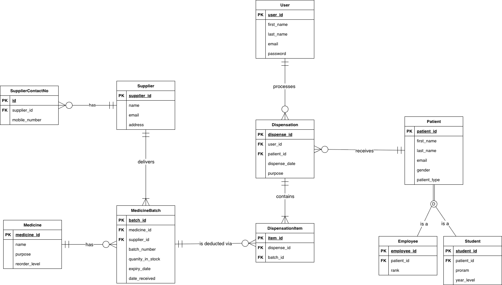

# Clinic Inventory System

## Business Rules

## Database Schema
### Core Reference Entities
- User(user_id (PK), first_name, last_name, email, password)
- Supplier(supplier_id (PK), name)
- SupplierContactNo(id (PK), supplier_id (FK), mobile_number)
### Patient Inheritance Entities
- Patient(patient_id (PK), first_name, last_name, email, gender)
- Employee(employee_id (PK), patient_id (FK), rank)
- Student(student_id (PK), patient_id (FK), program, year_level)
### Inventory & Stock Entities
- Medicine(medicine_id (PK), name, purpose, reorder_level)
- MedicineBatch(batch_id (PK), medicine_id (FK), supplier_id (FK), quantity_in_stock, expiry_date)
### Transaction Entities
- Dispensation(dispense_id (PK), user_id (FK), patient_id (FK), dispense_date, purpose)
- DispensationItem(dispense_id (PK, FK), batch_id (PK, FK), quantity)

## Entity Relationship Diagram

## Database SQL
- [`citu_clinic_inventory.sql`](citu_clinic_inventory.sql)