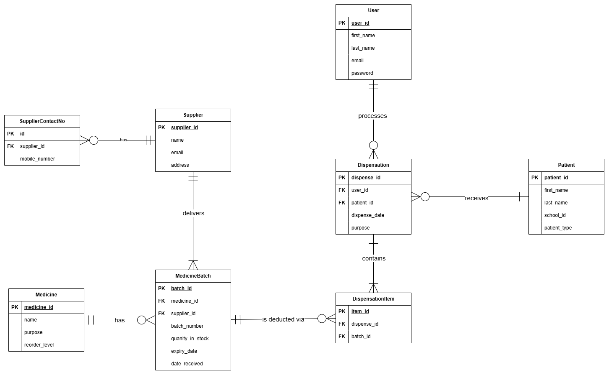

# Clinic Inventory System

## Business Rules
1. User Roles & Access The system shall support a single user role: Admin (Clinic Staff/Authorized Personnel). All authenticated users in the system possess full management and operational privileges, including inventory management, dispensation, and reporting.

2. Supplier & Batch Management Each physical box/batch of medicine (MedicineBatch) shall be associated with exactly one supplier. However, a single type of Medicine can be supplied by multiple different suppliers over time, allowing for flexible procurement.

3. FEFO Inventory Deduction When a medicine is dispensed, the system shall automatically deduct the requested quantity using FEFO (First Expire, First Out) logic. The system will prioritize depleting the active batches with the closest unexpired dates before pulling from newer stock.

4. Dispensation Authorization All authenticated Admin users shall be authorized to dispense medicines, and every transaction must be permanently recorded in the system.

5. Patient Registration Medicines shall only be dispensed to individuals registered in the Patient table. The system must explicitly categorize every patient as either a "Student" or an "Employee" to ensure accurate clinic demographic tracking.

6. Low Stock Thresholds The system shall visually flag medicines with a "Low Stock" badge and red text on the dashboard when their total combined active stock (across all batches) falls to or below the medicine's defined reorder level.

7. Expiration & Safe Discard The system shall strictly prevent the dispensing of any medicine whose expiry date has passed. When a batch expires, the system will prompt the Admin to "Discard" it. Discarding will safely set the active stock to zero without deleting the database record, preventing historical dispensation logs from breaking.

8. Inventory Replenishment As all users hold Admin privileges, any authenticated user shall be permitted to securely receive new supplies and increase the stock quantity of medicines in the system.

9. Manual Adjustments: Admins can manually adjust stock to correct physical discrepancies (e.g., damaged items), requiring a documented reason and generating an immutable audit log.

10. Accountability & Traceability The system shall permanently record all transactions using a dual-table structure (Dispensation and DispensationItem). This ensures total traceability by logging the timestamp, the authorized Admin responsible, the specific patient, the exact medical purpose/diagnosis, and the specific batches of medicine dispensed.

## Database Schema
### Core Reference Entities
- User(user_id (PK), first_name, last_name, email, password)
- Supplier(supplier_id (PK), name)
- SupplierContactNo(id (PK), supplier_id (FK), mobile_number)
### Patient Inheritance Entities
- Patient(patient_id (PK), first_name, last_name, email, gender)
- Employee(employee_id (PK), patient_id (FK), rank)
- Student(student_id (PK), patient_id (FK), program, year_level)
### Inventory & Stock Entities
- Medicine(medicine_id (PK), name, purpose, reorder_level)
- MedicineBatch(batch_id (PK), medicine_id (FK), supplier_id (FK), quantity_in_stock, expiry_date)
### Transaction Entities
- Dispensation(dispense_id (PK), user_id (FK), patient_id (FK), dispense_date, purpose)
- DispensationItem(dispense_id (PK, FK), batch_id (PK, FK), quantity)

## Entity Relationship Diagram

## Database SQL
- [`citu_clinic_inventory.sql`](citu_clinic_inventory.sql)